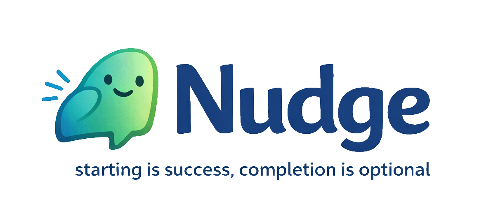

<p align="center">
  
</p>

<p align="center">
  <em>A gentle productivity companion for ADHD brains.</em>
</p>

<p align="center">
  <a href="#getting-started">Getting Started</a> &middot;
  <a href="#how-it-works">How It Works</a> &middot;
  <a href="#the-vault">The Vault</a> &middot;
  <a href="#development">Development</a> &middot;
  <a href="#contributing">Contributing</a>
</p>

---

## What is Nudge?

Nudge is an open-source desktop app that helps people with ADHD manage their ideas, plan their days, and actually get started on things — through a calm, conversational interface powered by modern LLM providers (Anthropic, OpenAI, or a custom OpenAI-compatible server).

It's not a task manager. It's not a planner. It's a supportive presence that surfaces small, concrete next steps and celebrates every start.

**Core mantra: "Starting is success, completion is optional."**

### What makes it different

- **Chat-forward** — Talk to Nudge like you'd talk to a friend. "Start my day." "I have 30 minutes." "I had an idea." It handles the rest.
- **Markdown backend** — All your data lives in plain markdown files you own. Edit them with any text editor, sync them with git, back them up however you want.
- **ADHD-first design** — No badges. No streaks. No red notification dots. No guilt. Just a quiet room that helps you start.
- **Fully local** — Your data never leaves your machine. No accounts, no telemetry, no cloud. You bring your own provider API key.
- **Provider choice** — Switch between Anthropic, OpenAI, or a custom OpenAI-compatible endpoint from Settings.

---

## Getting Started

### Prerequisites

- [Node.js](https://nodejs.org/) (v18+)
- An API key for your provider of choice:
  - [Anthropic](https://console.anthropic.com/)
  - [OpenAI](https://platform.openai.com/api-keys)
  - Custom OpenAI-compatible provider

### Install & Run

```bash
git clone https://github.com/your-username/nudge-app.git
cd nudge-app
npm install
npm run dev
```

On first launch, Nudge will walk you through:

1. Choosing your AI provider
2. Entering API credentials
3. For custom providers: entering Base URL and model name
4. Setting up your vault directory (defaults to `~/Nudge/`)
5. Starting your first conversation

---

## How It Works

### Talk to it

Nudge responds to natural language. Some things you can say:

| You say | Nudge does |
|---|---|
| "Start my day" | Scans your ideas and tasks, suggests 3-5 things to work on |
| "I have 30 minutes" | Filters for things that fit the time window, suggests a tiny first step |
| "I have an idea" | Captures it into a structured idea file with concrete starting steps |
| "Add a task" | Drops it into your task list instantly, no questions asked |
| "Wrap up my day" | Logs your wins, updates your daily log, celebrates what you did |

### The AI personality

Nudge is warm, brief, and biased toward action. It never guilts you about uncompleted items, never mentions streaks, and respects "not today" without pushback. The entire personality is defined in `system-prompt.md` inside your vault — you can customize it however you like.

---

## The Vault

Your vault is a plain directory of markdown files. No database, no proprietary formats.

```
~/Nudge/
├── ideas/
│   ├── _template.md
│   └── *.md              # One file per idea/project
├── daily/
│   └── YYYY-MM-DD.md     # One file per day
├── tasks.md               # Quick to-do checklist
├── config.md              # Your preferences and context
└── system-prompt.md       # AI personality (fully editable)
```

Every idea file has structured frontmatter (status, energy level, size, tags) and a "What does starting look like?" section with tiny, concrete first steps. Daily logs track what you chose to work on, your wins, and how the day felt.

You can open and edit any of these files directly from Nudge's built-in file explorer, or use your favorite text editor.

---

## Development

### Tech Stack

- **Electron** — Cross-platform desktop shell
- **React 19** + **Vite** — Fast renderer with HMR
- **TypeScript** — End to end
- **Provider adapters (Anthropic + OpenAI-compatible)** — Conversational AI with tool use
- **keytar** — Secure API key storage via OS keychain
- **react-markdown** + **remark-gfm** — Rich message rendering

### Commands

```bash
npm run dev          # Start dev server + Electron with hot reload
npm run build        # Production build (renderer + main + package)
```

### Building for macOS

To build Nudge as a standalone `.app` and install it to your Applications folder:

```bash
# 1. Install dependencies (if you haven't already)
npm install

# 2. Run the full production build
npm run build

# 3. Copy the app to ~/Applications
cp -R release/mac-arm64/Nudge.app ~/Applications/
```

> **Note:** If you're on an Intel Mac, the output path will be `release/mac/Nudge.app` instead.
>
> After copying, you can launch Nudge from Spotlight, Launchpad, or by double-clicking it in `~/Applications`. On first launch, macOS may warn that the app is from an unidentified developer — right-click the app and choose **Open** to bypass this.

### Project Structure

```
src/
├── main/            # Electron main process
│   ├── main.ts      # Window, IPC handlers, provider orchestration, vault ops
│   ├── providers/   # Provider implementations (Anthropic, OpenAI, custom)
│   └── preload.ts   # Context bridge (window.nudge API)
├── renderer/        # React frontend
│   ├── App.tsx      # Root component with routing
│   ├── components/  # Chat, FileExplorer, Settings, Onboarding
│   └── styles/      # Component CSS + global theme
└── shared/
    └── types.ts     # Shared TypeScript interfaces
```

---

## Privacy & Security

- **No telemetry.** Nudge does not phone home or collect any data.
- **No accounts.** There is no Nudge server. No login. No sign-up.
- **Local-only data.** Everything stays on your machine.
- **Secure key storage.** Your API key is stored in your OS keychain, never in plain text.
- **Transparent AI.** The system prompt is a file in your vault. No hidden behaviors.

For full details on the security architecture, vulnerability reporting, and best practices, see [SECURITY.md](SECURITY.md).

---

## Contributing

Contributions are welcome! Whether it's a bug report, a feature idea, or a pull request — every contribution matters.

See [CONTRIBUTING.md](CONTRIBUTING.md) for setup instructions, project structure, design principles, and guidelines for submitting changes.

---

## License

[MIT](LICENSE)
